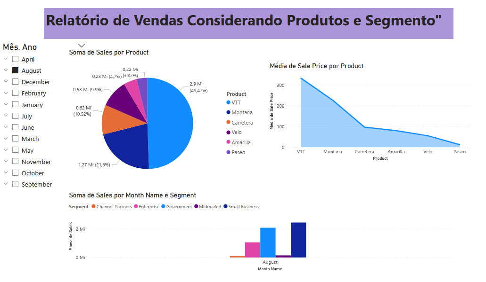
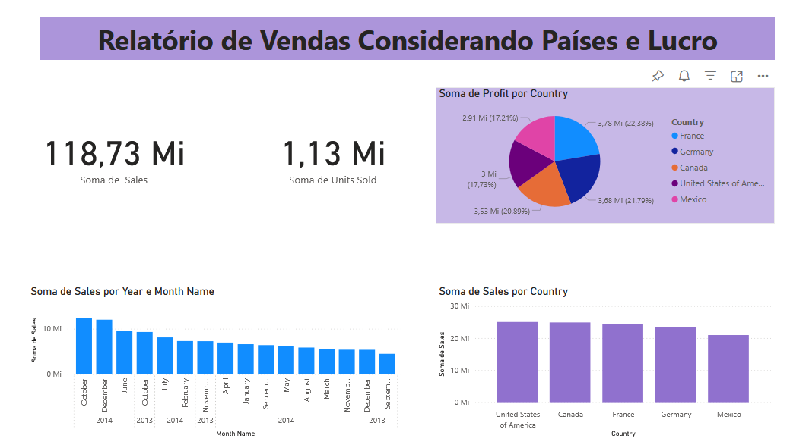
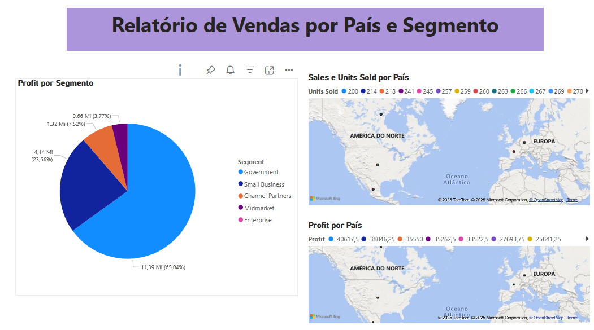

# Desafio Power BI - DIO

Este repositório contém o relatório em **Power BI** desenvolvido como parte do desafio da [Digital Innovation One (DIO)](https://www.dio.me/).

## 📊 Objetivo
Replicar as páginas já construídas no curso e criar uma terceira página com novos visuais, aplicando conceitos de visualização de dados.

## 🛠️ Dados Utilizados
- Dataset: **Financial Sample.xlsx** (fornecido pela DIO)
- Fonte: [Repositório original](https://github.com/julianazanelatto/power_bi_analyst)

## 📑 Estrutura do Relatório
- **Página 1**: Relatório de vendas considerando produtos e segmento  
- **Página 2**: Relatório de vendas considerando países e lucro  
- **Página 3**: Relatório criado do zero contendo:  
  - Mapa 1: Soma de Sales e Units Sold por País  
  - Mapa 2: Soma de Profit por País  
  - Pizza: Profit por Segment  

## 📷 Prints
### Página 1

### Página 2

### Página 3

## 🚀 Como abrir
Baixe o arquivo `Relatorio_DIO.pbix` e abra no **Power BI Desktop** ou carregue no **Power BI Service**.

---

